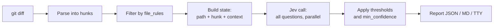

# jev-codes — PRD v1

2026-09-19 · @Someone

## Summary

jev-codes is a CLI plus a thin plugin that audits a git diff against standards the user defines, scores every hunk with TypeSafe's Jev model, and hands the coding agent a JSON list of what to fix. Jev never writes code; it only answers typed questions (yes/no, score, choice) with a probability. The agent reads the report and rewrites only the flagged hunks.

Why Jev: every question in a pack runs in one parallel call per hunk, output tokens are free, and calls return in under a second, so a full audit of a 500-line diff should cost well under $0.01 and finish in a few seconds.

Install: `npx jev-codes init`. Run: `npx jev-codes audit` or `/jev-audit` inside Claude Code.

## Scope

v1 is one command that turns a diff into a scored report, driven by editable standards packs, wrapped in a Claude Code plugin.

**In v1**

- Audit a diff (staged, working tree, or against a base ref) hunk by hunk with Jev
- Standards packs in YAML: a bundled `core` pack, plus per-repo overrides in `.jev-codes/standards.yaml`
- JSON, Markdown and terminal output; non-zero exit code when a high-severity flag crosses its threshold (so it works in CI too)
- `init` that stores the TypeSafe key and installs the plugin
- Claude Code plugin with a `/jev-audit` slash command that runs the audit and fixes flagged hunks
- `update` that pulls newer packs without reinstalling the CLI

**Not in v1**

- Hooks (Stop, PreToolUse). Command only.
- Generating or rewriting code. The agent does that.
- Correctness or "does this preserve behavior" judgments. Tests own that.
- Scoring several candidate rewrites against each other (v1.1)
- Adapters for other harnesses (Cursor, Codex CLI). The CLI is harness-agnostic; adapters come after Claude Code.

## CLI commands

Four commands. `audit` is the product; the rest are setup and upkeep.

| Command | What it does | Key flags |
| --- | --- | --- |
| `jev-codes init` | Prompts for the TypeSafe key (or reads `TYPESAFE_API_KEY`), writes `~/.jev-codes/config.json`, offers to install the Claude Code plugin | `--no-plugin`, `--key <k>` |
| `jev-codes audit` | Reads the diff, runs the pack, prints the report | `--staged` (default), `--base <ref>`, `--files <glob>`, `--pack <name>`, `--json`, `--md`, `--fail-on high\|medium\|none`, `--model <id>` |
| `jev-codes packs` | Lists installed packs and versions; `packs add <name>` installs one from the registry; `packs show <name>` prints its questions | `--registry <url>` |
| `jev-codes update` | Pulls the latest versions of installed packs; prints what changed | `--check` (dry run) |

Rules:

- Env var `TYPESAFE_API_KEY` always beats the config file.
- `audit` with no diff exits 0 and prints "nothing to audit".
- `--json` writes only JSON to stdout so the agent can parse it; human output goes to stderr.
- Default model id is `jev-latest`; `--model jev-1.13.0` pins it. The report always records the model that answered.

## Standards packs

A pack is a YAML file that lists the questions Jev answers about each hunk, the threshold that turns an answer into a flag, and the fix instruction the agent gets. Packs are the only thing that defines "good code" here; the CLI has no opinions of its own.

```yaml
name: core
version: 0.1.0
description: General hygiene for agent-written diffs
context_lines: 20          # lines of surrounding code sent with each hunk

questions:
  leftover_debug:
    type: noul               # yes/no -> probability 0..1
    ask: "The added lines include a debugging statement (print, console.log, debugger, dump) that is not part of the feature"
    threshold: 0.7
    severity: high
    fix: "Remove the debug statement."

  duplicate_logic:
    type: noul
    ask: "The added lines re-implement logic that already exists in the surrounding context"
    threshold: 0.7
    severity: medium
    fix: "Call the existing helper instead of re-implementing it."

  swallowed_error:
    type: noul
    ask: "An error is caught and then ignored, logged only, or replaced with a silent default"
    threshold: 0.75
    severity: high
    fix: "Re-throw, handle, or surface the error."

  comment_noise:
    type: noul
    ask: "The added comments restate what the code plainly does instead of explaining why"
    threshold: 0.7
    severity: low
    fix: "Delete comments that restate the code."

  abstraction_level:
    type: score              # ordered levels -> position 0..N-1, can be fractional
    ask: "How much abstraction do the added lines introduce relative to what the change needs"
    levels:
      - "None beyond what the change needs"
      - "One small helper or type that is used once"
      - "A new layer, class, or config that nothing else uses yet"
      - "A framework for a problem the change does not have"
    threshold: 1.5
    severity: medium
    fix: "Inline the abstraction; keep only what this change uses."

  change_kind:
    type: choice             # one option from a set -> choice + probabilities + confidence
    ask: "What kind of change is this hunk"
    options:
      feature: "Adds behavior"
      fix: "Corrects behavior"
      refactor: "Same behavior, different structure"
      test: "Adds or changes tests"
      chore: "Config, deps, formatting, docs"
      other: "Does not fit the above"
    report_only: true        # never flags; goes in the report for labeling

file_rules:
  ignore: ["**/*.lock", "**/dist/**", "**/*.min.js", "**/*.snap"]
```

Schema rules for the implementer:

- `type` is one of `noul`, `score`, `choice`, matching Jev's three primitives. `score` needs 2–10 `levels`; `choice` needs `options` (max 255) and should always include an `other`.
- A question flags when its value crosses `threshold` (`noul` value, `score` position, or for `choice` when `choice` equals `flag_on` with confidence ≥ `threshold`). `report_only: true` disables flagging.
- `min_confidence` (default 0.5) is a global floor: below it the answer is reported as `uncertain`, never flagged.
- Pack resolution order: `--pack` flag → `.jev-codes/standards.yaml` in the repo → `core`. A repo file can `extends: core` and override or add questions by key.
- Keep every question one judgment. No "and". No negations in `ask`. Jev reads literally.

## Audit flow

One Jev call per hunk, all pack questions in that one call, results aggregated in code.



Each hunk becomes one state object and one Jev request; hunks run in parallel with a concurrency cap.

**State sent per hunk**

```json
{
  "file": "src/payments/refund.ts",
  "language": "typescript",
  "hunk": "@@ -40,6 +40,14 @@ ...the raw unified-diff hunk...",
  "context_before": "...up to context_lines of code above the hunk, from the new file...",
  "context_after": "...up to context_lines below..."
}
```

**Rules**

1. Diff source: `git diff --cached` by default; `--base <ref>` uses `git diff <ref>...HEAD`; unstaged working tree with `--working`.
2. Only added and changed lines are judged. Pure deletions are skipped unless a pack sets `judge_deletions: true`.
3. A hunk plus its context must stay under 24k tokens (limit is 32k for state plus the longest question). Bigger hunks are split at blank-line boundaries and marked `split: true` in the report.
4. Send every question in the pack in one request. Do not loop questions one at a time; a tenth question costs tokens but almost no time.
5. Concurrency: 8 hunks in flight by default; back off on HTTP 429 (SDK does this).
6. Strip comments from `context_before` and `context_after` when `strip_context_comments: true` (default on). Hunk comments stay, because `comment_noise` needs them.
7. Cache by hash of (state, pack version, model id) in `~/.jev-codes/cache/` so a re-run after fixing one file only re-scores changed hunks.
8. Never send files matched by `file_rules.ignore`, `.env*`, or anything `.gitignore`d.

## Report format

The JSON report is the contract between the CLI and any agent. Findings are sorted by severity, then confidence.

```json
{
  "version": 1,
  "model": "jev-1.13.0",
  "pack": "core@0.1.0",
  "diff": { "source": "staged", "files": 4, "hunks": 12, "skipped_files": ["pnpm-lock.yaml"] },
  "summary": { "flagged_hunks": 3, "high": 1, "medium": 2, "low": 0, "uncertain": 1, "cost_usd": 0.0021, "ms": 1840 },
  "findings": [
    {
      "file": "src/payments/refund.ts",
      "hunk": "@@ -40,6 +40,14 @@",
      "new_lines": [44, 51],
      "question": "swallowed_error",
      "type": "noul",
      "value": 0.91,
      "confidence": null,
      "severity": "high",
      "fix": "Re-throw, handle, or surface the error."
    },
    {
      "file": "src/payments/refund.ts",
      "hunk": "@@ -40,6 +40,14 @@",
      "new_lines": [44, 51],
      "question": "abstraction_level",
      "type": "score",
      "value": 2.3,
      "confidence": 0.81,
      "severity": "medium",
      "fix": "Inline the abstraction; keep only what this change uses."
    }
  ],
  "labels": [ { "file": "src/payments/refund.ts", "hunk": "@@ -40,6 +40,14 @@", "question": "change_kind", "choice": "feature", "confidence": 0.93 } ],
  "uncertain": [ { "file": "src/utils/date.ts", "hunk": "@@ -1,3 +1,9 @@", "question": "duplicate_logic", "value": 0.55, "confidence": 0.41 } ]
}
```

- `findings` = crossed threshold and confidence ≥ `min_confidence`. `uncertain` = crossed threshold but low confidence; shown, never auto-fixed. `labels` = `report_only` questions.
- `new_lines` is the line range in the new file, so the agent can open the exact spot.
- Terminal output: one line per finding, `file:line  severity  question  value  fix`, then a one-line total with cost and time.
- Markdown output (`--md`): same table plus a header with model, pack and diff source, for pasting into a PR description.
- Exit codes: 0 clean or below `--fail-on`; 1 findings at or above `--fail-on`; 2 config or auth error; 3 API error after retries.

## Plugin

The plugin is a thin wrapper: one slash command that runs the CLI and acts on the JSON. All logic lives in the CLI so any harness can get the same behavior with a few lines of glue.

**Claude Code (v1)**

- Package layout: `.claude-plugin/plugin.json` + `commands/jev-audit.md`. Distributed through a marketplace repo (`jev-codes/claude-plugin`) so `claude plugin marketplace add` and `claude plugin install jev-codes` work, and updates flow through the marketplace.
- `/jev-audit [--base ref] [--pack name]` does, in order:
  1. Run `npx jev-codes audit --json <args>` via Bash and parse stdout.
  2. If `findings` is empty: say so in one line and stop.
  3. For each finding with severity `high` or `medium`, open the file at `new_lines`, apply the `fix` instruction to that hunk only, and change nothing else.
  4. List `low` and `uncertain` items without fixing them.
  5. Re-run the audit once and print the before/after counts.
- The command prompt must tell the agent: never widen the change beyond the flagged lines, never touch files not in the report, and never argue with a flag; if the fix is wrong for the code, leave it and say why.

**Generic adapters (after v1)**

- Cursor and Codex CLI: a command file that runs the same `audit --json` and uses the same fix loop.
- Plain git: `jev-codes audit --fail-on high` as a pre-commit or CI step. No agent needed; the Markdown report goes in the PR.
- The JSON `version` field is the compatibility contract. Adapters check it and refuse newer majors.

## Distribution and updates

The CLI ships on npm, the plugin ships through a Claude Code marketplace, and packs ship as a separate registry so new standards reach users without a CLI release.

| Piece | Where it lives | How users get it | How updates reach them |
| --- | --- | --- | --- |
| CLI | npm package `jev-codes` | `npx jev-codes init` | `npx` fetches the latest each run; a pinned version via `npx jev-codes@0.2.0` |
| Claude Code plugin | GitHub repo `jev-codes/claude-plugin` (marketplace) | `init` runs the two `claude plugin` commands for them | Marketplace update; `init --plugin` re-runs it |
| Packs | GitHub repo `jev-codes/packs`, one YAML per pack plus an `index.json` with versions and checksums | `core` is bundled with the CLI; others via `packs add` | `jev-codes update`; `audit` prints a one-line nudge when `index.json` shows a newer version (checked at most once a day) |

Rules:

- `init` never asks for anything except the key. Everything else has a default.
- The key is stored in `~/.jev-codes/config.json` with file mode 600. It is never written into a repo.
- Pack updates never change thresholds silently. `update` prints a diff of questions and thresholds and asks to confirm unless `--yes`.
- The bundled `core` pack is pinned to the CLI version; the registry copy can be newer. Whichever is newer wins.
- Telemetry: none in v1.

## Stack and repo layout

TypeScript on Node 20+, published as a single npm package with a `bin` entry, so `npx` works with no install step.

- Jev client: `@typesafe-ai/sdk` (reads `TYPESAFE_API_KEY`, defaults to `jev-latest`, retries 429s). Wrap it behind one `Scorer` interface so a second backend can be added later without touching the audit code.
- Diff parsing: `parse-diff` or a small hand-written unified-diff parser; `simple-git` for running git.
- YAML: `yaml`. Schema validation: `zod`, with a clear error naming the pack and key.
- CLI: `commander`. Output: plain `console`, no heavy TUI.
- Tests: `vitest`. Fixture diffs live in `test/fixtures/` with expected findings so the pack can be regression-tested without calling Jev (mock `Scorer`).

```
jev-codes/
  package.json            # bin: jev-codes
  src/
    cli.ts                # commander entry
    commands/{init,audit,packs,update}.ts
    diff/{parse,hunks}.ts
    packs/{schema,load,resolve}.ts
    scorer/{types,jev}.ts  # Scorer interface + Jev impl
    report/{build,json,md,tty}.ts
    config.ts              # ~/.jev-codes handling
    cache.ts
  packs/core.yaml         # bundled pack
  claude-plugin/          # published separately as the marketplace repo
    .claude-plugin/plugin.json
    commands/jev-audit.md
  test/
```

## Acceptance criteria

v1 is done when all of these pass on a fresh machine.

- [ ] `npx jev-codes init` with a valid key finishes in one prompt and writes the config with mode 600
- [ ] `npx jev-codes audit --staged --json` on a 500-line staged diff returns valid JSON in under 10 s and reports `cost_usd` under 0.01
- [ ] A diff containing a `console.log`, a swallowed `catch`, and a re-implemented helper produces `high`, `high`, `medium` findings with the right `file` and `new_lines`
- [ ] A clean diff of the same size produces zero findings and exit code 0
- [ ] `--fail-on high` exits 1 when a high finding exists and 0 otherwise
- [ ] A repo `.jev-codes/standards.yaml` with `extends: core` that changes one threshold changes the result; a malformed pack fails with an error naming the key
- [ ] Lock files, `dist/`, and `.env*` never appear in the request log
- [ ] Re-running `audit` after fixing one file only re-scores that file's hunks (cache hit count in `--verbose`)
- [ ] `/jev-audit` in Claude Code fixes the flagged hunks, touches no other lines, and prints before/after counts
- [ ] `jev-codes update` shows the question and threshold diff before applying
- [ ] Precision check: on 50 hand-labeled diffs, findings at `high` are correct at least 80% of the time. If lower, tune thresholds and question wording before publishing; do not ship below 70%.
- [ ] `vitest` passes with the mock `Scorer`; no test calls the real API

## Constraints, risks, open questions

Jev's limits shape the design; the biggest unknown is whether it judges code well at all.

**Jev constraints to build around**

- Text only. No images. Input limits: 64k tokens for state plus all questions, 32k for state plus the longest question.
- No reasoning, no rationale. A finding is a number. The `fix` text in the pack is the only explanation the user sees.
- Reads literally. Negations and "and" in a question degrade answers. One judgment per question.
- Not a calculator. Never ask it to count lines or compare dates; do that in code.
- State is not treated as hostile. Comments in the hunk can steer answers. Context comments are stripped by default; hunk comments are a known gap.
- Rate limits (as of launch): 250k tokens/s and 1,200 requests/min, subject to change. Concurrency cap plus SDK backoff handles this.
- Confidence is meaningful in aggregate, not per answer. Thresholds are tuned on the labeled set, not reasoned from first principles.

**Risks**

- Jev may be weak on code. Its public benchmarks are workflow decisions, not code review. The 50-diff precision check is the gate; the `Scorer` interface is the escape hatch.
- Access is waitlisted. Users without a TypeSafe key cannot use the tool. The Vercel AI Gateway also lists Jev and may be an easier key for some users; `init` should accept either.
- Prior art exists (a community `jev-review` repo, TypeSafe's own Claude Code skill). The differentiator is editable packs plus the fix loop, not the model.
- Code leaves the machine. State the data path in the README and keep per-hunk sending; no whole-file uploads.

**Open questions**

- [ ] Does `@typesafe-ai/sdk` expose per-request token counts for `cost_usd`, or do we estimate from state length?
- [ ] Should `uncertain` items block `--fail-on high`? Proposed: no.
- [ ] Pack registry: GitHub raw `index.json` (simple) or an npm package `@jev-codes/packs` (versioned, signed)? Proposed: GitHub for v1.
- [ ] v1.1 candidate: `jev-codes judge` to score 2–3 candidate rewrites of one hunk on readability, change size, and reuse, and pick in code.
